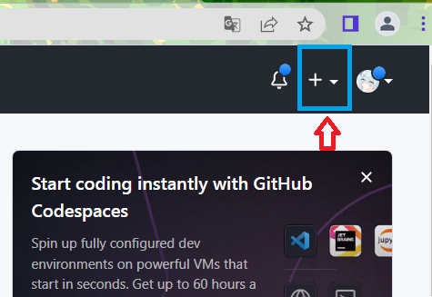
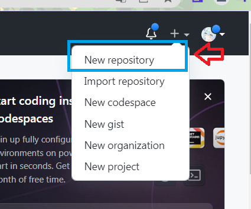
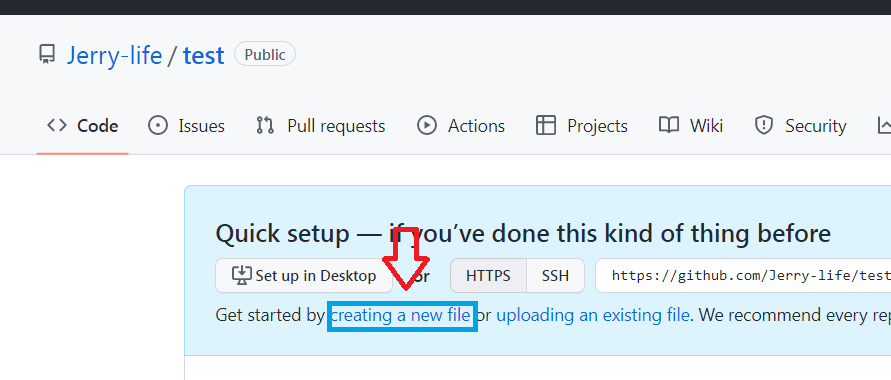
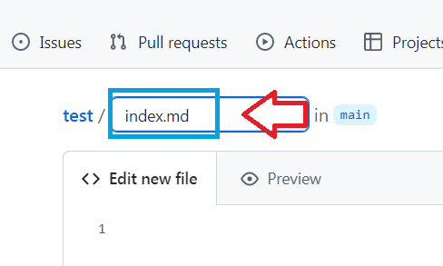

在這個科技日新月異的時代，編寫網頁也開始普及化。傳統的網頁多分為動態與靜態網頁，均需要有一定的HTML基礎。今天要介紹的是通過Jekyll on GitHub Pages來實現完全***零基礎且免費***架設網頁。
### Part 1 準備
我們推介妳使用最新(108.0.5359.112 穩定版本)版基於Chromium內核的Chrome/Edge，以確保在架設其中不會出現任何未知的錯誤。同時，我們也支持與鼓勵妳多參閱[官方文獻](https://docs.github.com/en)!
1. [Github account](https://github.com/signup?ref_cta=Sign+up&ref_loc=header+logged+out&ref_page=%2F&source=header-home) [MUST]
2. [Vscode](https://code.visualstudio.com/) [IF you need]
3. [Github desktop](https://desktop.github.com/) [IF you need]
### Part 2 建立容器並上傳必要文件
1. 建立容器 

所有設置以默認即可，按**Create repository**建立容器

2. 創建***index.md***作為妳的根文件 

 
***重要[^1]***

[^1]: 在此步驟中，妳不能把文件名改為其他，必須為**index.xxx**。否則Github page將不能檢測其為主頁面，可能導致404的錯誤。
