在這個科技日新月異的時代，編寫網頁也開始普及化。傳統的網頁多分為動態與靜態網頁，均需要有一定的HTML基礎。今天要介紹的是通過Jekyll on GitHub Pages來實現完全***零基礎且免費***架設網頁。
### Part 1 準備
我們推介妳使用最新(108.0.5359.112 穩定版本)版基於Chromium內核的Chrome/Edge，以確保在架設其中不會出現任何未知的錯誤。同時，我們也支持與鼓勵妳多參閱[官方文獻](https://docs.github.com/en)!
1. [Github account](https://github.com/signup?ref_cta=Sign+up&ref_loc=header+logged+out&ref_page=%2F&source=header-home) [MUST]
2. [Vscode](https://code.visualstudio.com/) [IF you need]
3. [Github desktop](https://desktop.github.com/) [IF you need]
### Part 2 建立容器並上傳必要文件
A. 建立容器<br/>


所有設置以默認即可，按**Create repository**建立容器

B. 創建***index.md***作為妳的根文件<br/>

<br/>
***重要[^1]***

C. 參考【B】創建_config.yml<br/>
D. 點擊並下載本網頁中的zip源碼，並解壓<br/>
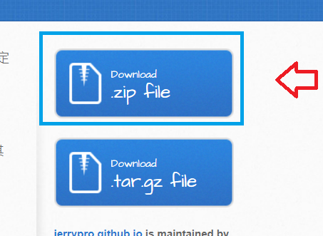
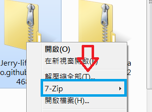
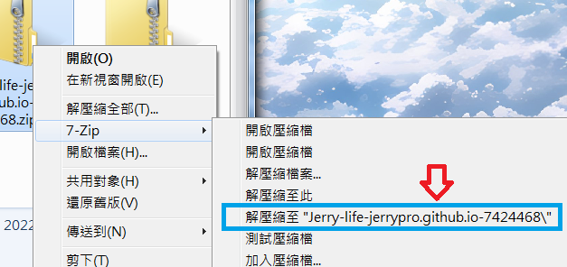
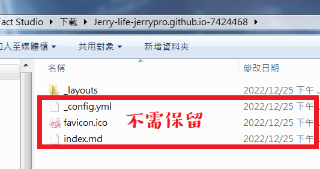<br/>
E. 在【D】中已解壓的_layouts文件夾完整拖動並上傳
#### Part 2 Summary
經過以上步驟，妳應該會得到一下的文件(excluded***Resources***&***favicon.ico***)
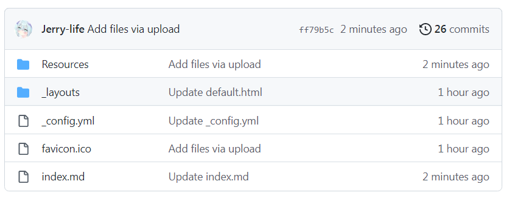

### Part 3 修改config
在開始前，請參閱以下官方文獻，有助你將來的操作：[About GitHub Pages and Jekyll](https://docs.github.com/en/pages/setting-up-a-github-pages-site-with-jekyll/about-github-pages-and-jekyll) & [Supported themes](https://pages.github.com/themes/)
```
remote_theme: pages-themes/architect@v0.2.0
plugins:
- jekyll-remote-theme # add this line to the plugins list if you already have one
title: JERRY PRO[By YouTube]
description: Build your first website without code!
show_downloads: true
```
***remote_theme*** & ***plugins***是根據妳需要的皮膚所更改的。<br/>
***title***是妳網頁的標題。<br/>
***show_downloads***決定了網頁是否允許與顯示下載源碼按鈕。<br/>

### Part 4 修改index
在開始前，請參閱以下官方文獻，有助你將來的操作：[Quickstart for writing on GitHub](https://docs.github.com/en/get-started/writing-on-github/getting-started-with-writing-and-formatting-on-github/quickstart-for-writing-on-github)
```
---
layout: default
---
# Hello World
```
請根據[Quickstart for writing on GitHub](https://docs.github.com/en/get-started/writing-on-github/getting-started-with-writing-and-formatting-on-github/quickstart-for-writing-on-github)所提供的入門語法，修改妳index.md的內容。請注意這將會是你網頁將會顯示的內容。

### Part 5 修改Favicon
Favicon就是妳網頁的圖標，它會出現在瀏覽器標籤列的左方<br/>
把你想要的圖標通過[cloudconvert](https://cloudconvert.com/png-to-ico)轉換，並重命名為***favicon.ico***，上傳即可!

### Part 6 啟用Github page
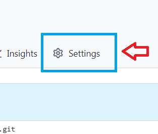
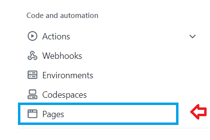
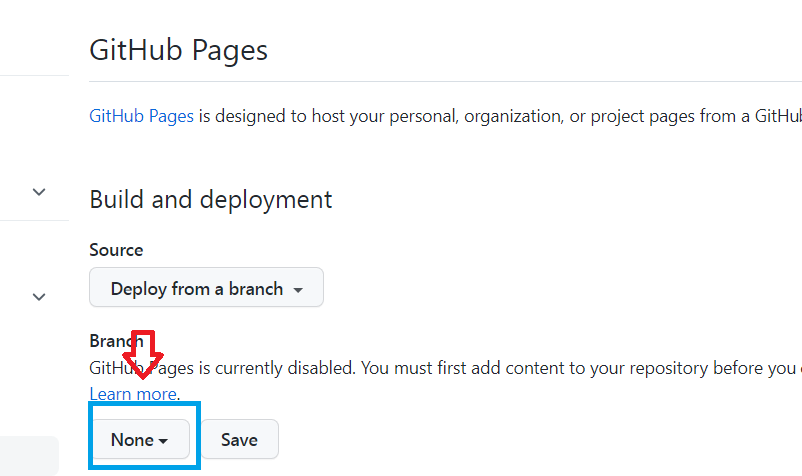
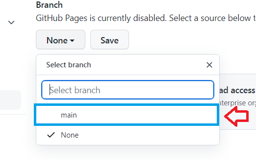
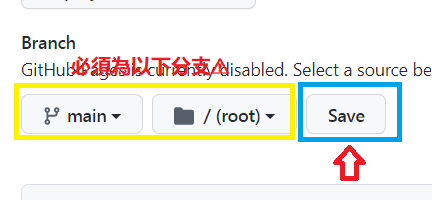<br/>
等待數分鐘並看到以下畫面，即代表成功!
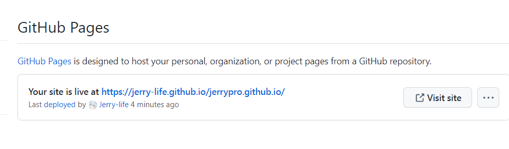

### Part 7 END
感謝妳的參閱！❤ Supported by ***JERRYPRO***

[^1]: 在此步驟中，妳不能把文件名改為其他，必須為**index.xxx**。否則Github page將不能檢測其為主頁面，可能導致404的錯誤。
